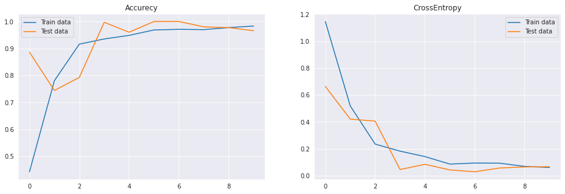
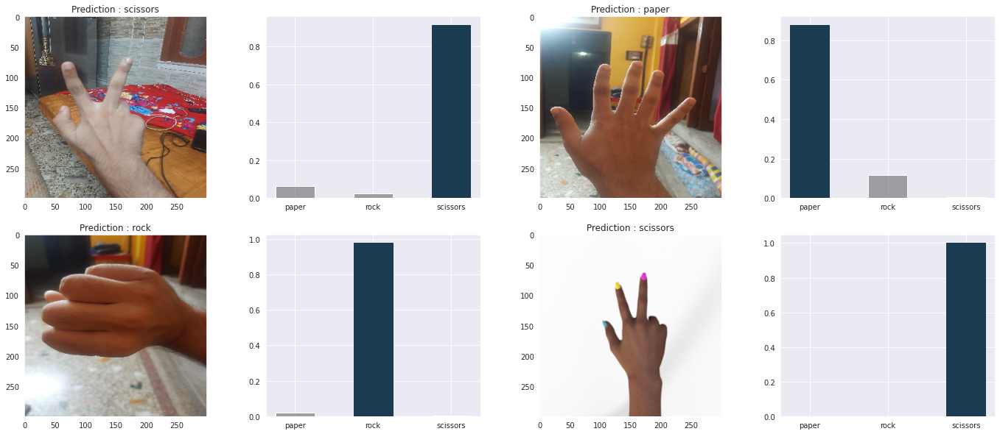

# stone-paper-scissors

**********************************************
    Remove # (un-comment the commented statements) 
        >> TRAIN_URL = "https://storage.googleapis.com/download.tensorflow.org/data/rps.zip"             #code block  --> 8
        >> TEST_URL = "https://storage.googleapis.com/download.tensorflow.org/data/rps-test-set.zip"
        
        >> train_dir = tf.keras.utils.get_file("current_dir/train.zip" , TRAIN_URL)                      #code block  --> 3
        >> test_dir = tf.keras.utils.get_file("current_dir/test.zip" , TEST_URL)                         #code block  --> 4
        
        >> fl1 = zipfile.ZipFile(train_dir , 'r')
        >> fl2 = zipfile.ZipFile(test_dir , 'r')
        
        >> os.chdir(current_dir)                                                                         #code block  --> 6
        >> os.mkdir("./data")
        >> fl1.extractall("./data")
        >> fl2.extractall("./data")
        
        >> train_dir_ = "./data/rps"                                                                     #code block  --> 8
        >> test_dir_  = "./data/rps-test-set"

************************************************
    Change your dir to your current dir :
        >>  os.chdir(current_dir)
    If you are not using google colab , then please don't use 
        >> from google.colab import files
        >> files.upload()
    these two lines! , this is very very important .
************************************************    
## Accurecy & CrossEntropy Graph
     Max acc for training dataset -> 100%
     Max acc for testing  dataset -> 100%
    

*************************************************

## Final Output of this NoteBook

# Happy Coding
